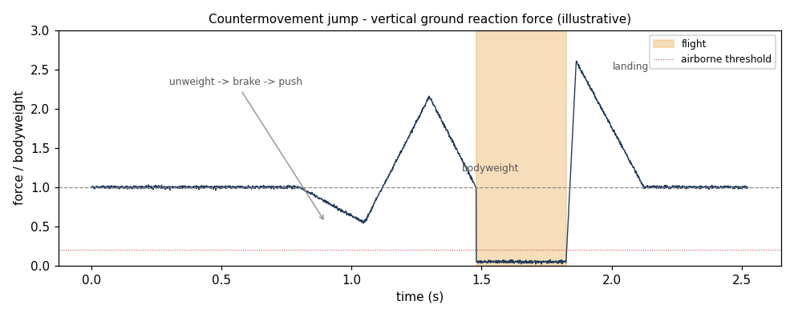

# forceplate

[](https://github.com/Bilalovski/forceplate-jump-analysis/actions/workflows/ci.yml)

Vertical-jump analysis from force-plate recordings — jump height, flight time,
and left/right asymmetry — computed straight from raw load-cell data.



The interesting part is how jump height is validated. These recordings have no
ground-truth height, so it's computed **two physically independent ways**, and
them agreeing is the check:

- **Flight time.** While the athlete is airborne the plates read no force, so
  the duration of that gap gives height by projectile motion, `h = g·t²/8`.
  Needs nothing but timing — no calibration, no bodyweight.
- **Impulse–momentum.** Integrate the body's acceleration from movement onset to
  takeoff to get takeoff velocity, then `h = v²/2g`. The sports-science gold
  standard, and it uses the whole propulsion phase, not just the airborne gap.

On a real countermovement jump the two land at **14.6 cm** (flight time) and
**10.4 cm** (impulse) — a few centimetres apart, which is the expected
discrepancy between them (flight time reads slightly high because the ankles are
still extending at takeoff). The synthetic-jump tests prove both recover a
*known* height to within 1 cm.

## Why raw ADC counts are enough

The load cells are logged as uncalibrated 16-bit ADC counts, and the analysis
never needs the calibration constant. Acceleration works out to

```
a = g · (F − bodyweight) / (bodyweight − unloaded)
```

and the unknown counts-to-newtons scale cancels in that ratio. Bodyweight comes
from the quiet-stance median, the unloaded (zero-force) level from the airborne
samples — both read off the same signal. So height comes straight from the raw
counts; only timing and those two levels are needed.

## Bilateral asymmetry

It's a **two-platform** rig, so it also reports left/right load imbalance at
quiet stance (`+3.8%` on that recording — the left leg carrying more). A
single-plate setup can't compute this; it's the metric used in ACL
return-to-play screening, where a leg still 10–15% weak is a re-injury risk.

## Usage

```bash
pip install -e ".[dev]"
forceplate path/to/recording.txt
```

```
recording.txt: 2 platform(s), 1000 Hz, 8.1 s
  flight time               345 ms
  jump height (flight)     14.6 cm
  jump height (impulse)    10.4 cm
  method agreement          4.2 cm
  L/R asymmetry            +3.8 %  (left carries more)
```

Input is [OpenSignals](https://www.pluxbiosignals.com) text format from a
biosignalsplux DAQ — a JSON header (sampling rate, channels), then tab-separated
samples, one platform's force being the sum of its four load-cell channels.

## No recordings are shipped

The recordings this was built on are a research subject's biometric data, so
they're **not in this repo**. The algorithms are validated against synthetic
jumps with known heights (`tests/`); the real numbers above were measured
locally. To run it on real data, point the CLI at your own OpenSignals `.txt`.

## Layout

```
src/forceplate/
  parse.py     OpenSignals -> per-platform force (handles 1 or 2 platforms)
  metrics.py   quiet-stance / flight detection, both height methods, asymmetry
  cli.py       the forceplate command
docs/plot.py   regenerates the force-time figure (synthetic, illustrative)
tests/         synthetic jumps with known heights; both methods must recover them
```

## Provenance

A rewrite of an earlier MATLAB App Designer GUI (`DSPMatlab`) into a tested,
reviewable Python library. The MATLAB version computed jump height by the
impulse method inside a binary `.mlapp`; this adds the independent flight-time
cross-check, bilateral asymmetry, the calibration-free derivation, and a test
suite.

## Scope and limits

- **Countermovement / squat jumps** (vertical). A standing long jump is
  horizontal and is correctly rejected as "not a vertical jump."
- **Detection thresholds are fixed**, tuned to clean trials. Robust adaptive
  detection across subjects — one athlete's jump may not unload past a fixed
  threshold — is the natural next step, not yet done.
- **Asymmetry is measured at quiet stance**, not per-leg takeoff impulse (which
  the dual-platform data could also support).
